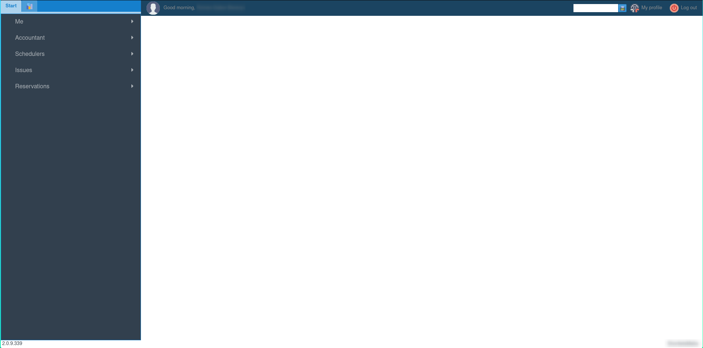

# Getting Started with the Main UI

## Overview

### 1. Navigation Bar (Left Side)
#### 1.1. Start
##### 1.1.1. Me
- **Change Company:** If you have multiple companies, you can switch between them without reloading the page.
- **My Leaves/Vacations:** View or request your leaves and vacations.

##### 1.1.2. Account
- **Dashboard:** Access your account dashboard. For more details, check the [Account](../accounts/account.md) page.

##### 1.1.3. Schedule
- **Cleaning Schedule:** View the daily cleaning schedule.
- **Jacuzzi Schedule:** View the daily jacuzzi schedule.
- **Checklist Editor:** Access the checklist editor to manage the tasks that need to be completed before check-in.
#### 1.2 Properties
Here you can see a list of hierarchies and properties that you have access to.
For more details, check the [Properties](../property/general.md) page.
### 2. Top Bar (Top Side)
#### My Profile
- View your profile, change your password, or update your notification settings.

#### Logout
- Log out and return to the login screen.

#### Search Function
Leviathan PCRMS offers various search functions accessible using specific prefixes. Here is a list of available prefixes:

- `RR` - Search for a Reservation Header ID.
- `RS` - Search for a Reservation Stay ID.
- `RC` - Search for a Reservation Channel ID from an ([OTA](../property/listing/ota.md)).

### 3. Main Area (Center)
The main area is where the system displays different modules depending on what you have selected.

