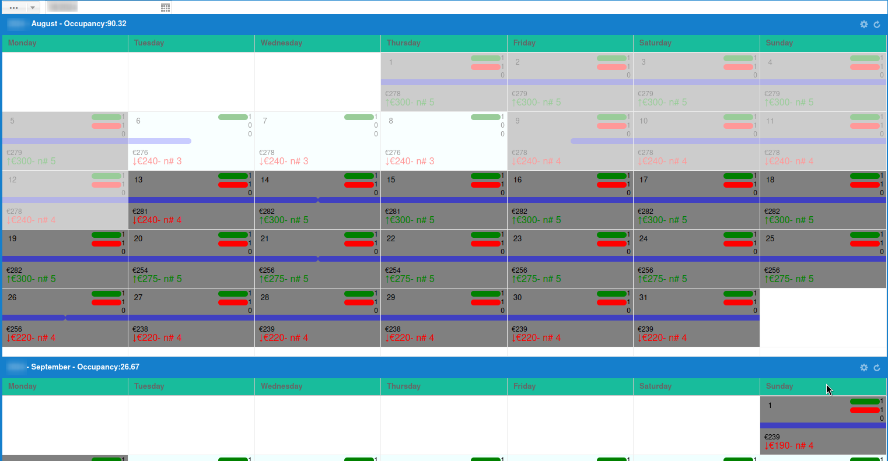

# How to Use the Calendar

## Step 1: Open Any Listing Property

## Step 2: Click on the Calendar Icon
### **Note:** The Calendar Icon  is located on the left side of the screen at the top of the page.

## Step 3: View the Calendar
### General Calendar Information
- At the top you can select the starting month and year. Once this is changed, the calendar will load 6 months ahead.
- Each cell in the calendar represents a single day.
- The calendar uses multiple color codes to represent different booking statuses:
    - **White**: Available
    - **Gray**: Reserved
    - **Orange**: Missing Price or Availability
- At the top of the cell on the right topside you can see different values (lines)
    - **First line**: Shows the requested availability for that day.
    - **Second line**: Shows the number of bookings .
## Different Versions of the Calendar

### **Single Unit View**
In this view, you can see the availability and price per day of a **single** unit.

### **Multiple Unit View**
In this view you can see the availability and price per day of **multiple** units.

