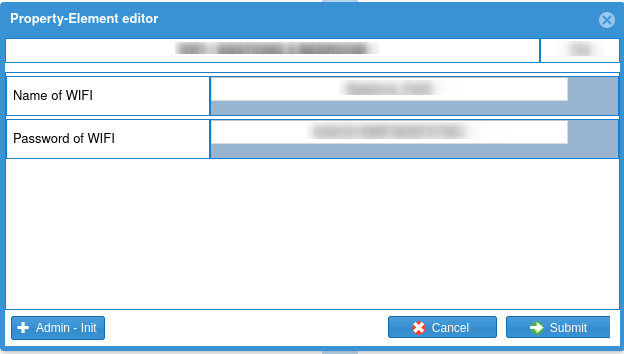

# How to Edit Elements in Physical Property

## Step 1: Open an Existing Physical Property
Open the Physical Property where the element is located in the Leviathan PCRMS.

## Step 2: Right-Click on the Element
{ align=center }

## Step 3: Understanding the Element Editor
- **Name**: The name of the element.
    - Click on the name of the element to open the name popup editor.
    
{ align=center }

- **Property Element Infos**: Essential key-value pairs that provide information about the element.
    - The list displays possible or filled key-value pairs of the element.

{ align=center }

