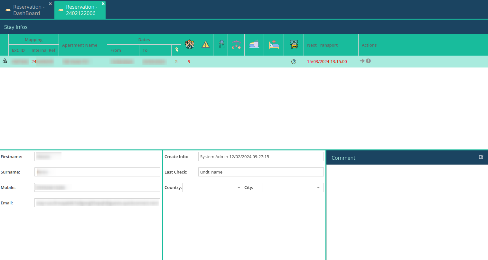
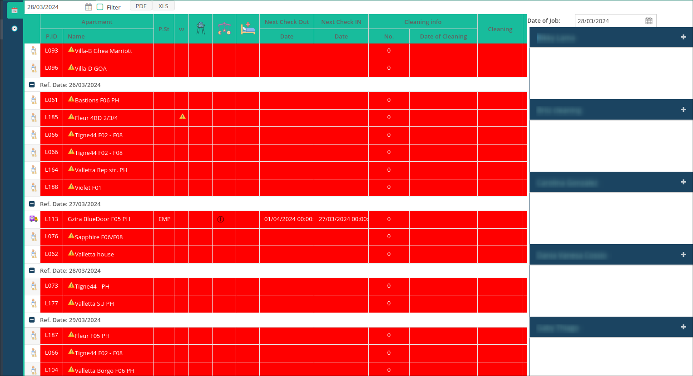
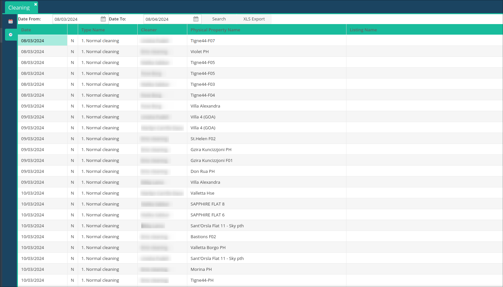
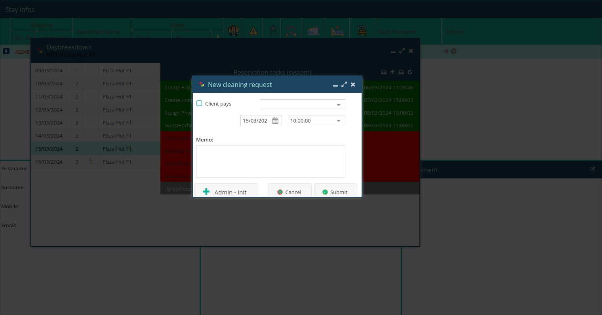

# Release Notes: Version 2.0.5

We are thrilled to announce version 2.0.5, a comprehensive update that not only introduces a reworked Reservation Info UI, sub-module popups, and seamless next taxi information but also enhances your cleaning schedule. In this release, the cleaning schedule now intelligently highlights upcoming arrivals that require a refresh and specifies whether additional items such as a cot, highchair, or extra bed are needed.

## What's New:

### 1. Reworked Reservation Info UI

- **Streamlined Design:**
    - Experience a redesigned Reservation Info UI for a more intuitive and user-friendly layout.

- **Enhanced Visibility:**
    - Key details are now presented prominently, offering a comprehensive overview of each reservation with improved visibility.
    

### 2. Sub-modules as Popups

- **Efficient Access:**
    - Sub-modules that were traditionally loaded in the bottom left corner have been transformed into popups, ensuring easy access without cluttering the main interface.

### 3. Next Taxi Information

- **Immediate Access:**
    - The details of the next available taxi are now conveniently displayed right next to the stay information, providing quick access to transportation details.

### 4. Cleaning Schedule Enhancements

- **Arrival Refresh Indicator:**
    - The cleaning schedule now highlights upcoming arrivals that require a refresh, ensuring your team stays informed and can maintain a seamless turnover.
        

- **Additional Item Requirements:**
    - Easily identify if a reservation requires additional items such as a cot, highchair, or extra bed directly from the cleaning schedule.

- **Search History by Date:**
    - New functionality allows you to search the cleaning schedule history by specifying a date range, providing enhanced visibility and control over past activities. This function is available when you click the clock icon on the left.
    

- **Create Cleaning Requests:**
    - Now, it's possible to create cleaning requests directly from the reservation breakdown form, streamlining the process and ensuring timely communication with your cleaning team.
    

### 5. Property Selection in Statistics

- **Enhanced Visibility:**
    - When searching by property in the statistics section, selected properties are now clearly indicated, providing a quick reference for your analysis.

### 6. Bug Fixes

- **Reservation Dashboard Naming Issue:**
    - Addressed a naming issue in the reservation dashboard for a smoother and more accurate user experience.

- **Statistics by Apartment:**
    - Fixed a bug that now allows statistics by apartment to be opened multiple times without any issues.

### 7. Version Verification

- **Check Version:**
    - Confirm you are using version 2.0.5 by checking the version number at the bottom left corner of your reservation system.

## Why It Matters:

Version 2.0.5 is designed to enhance your reservation management experience by offering a reworked UI, sub-module popups, and seamless integration of next taxi information. These features collectively contribute to a more efficient and visually appealing workflow.

## How It Works:

Explore the redesigned Reservation Info UI, interact seamlessly with sub-module popups, and effortlessly access next taxi information right next to the stay details.

## Important Note:

Ensure you are using version 2.0.5 by checking the version number at the bottom left corner of your reservation system. If not visible, press 'F5' to refresh.

## Upgrade Instructions:

Version 2.0.5 is automatically effective. Log in to your reservation system to experience the new features. For any inquiries or assistance, our support team is ready to help.

Thank you for choosing our reservation system. We are committed to continuous improvement and providing you with a top-notch reservation management experience.

**Best regards,**  
Leviathan Systems

