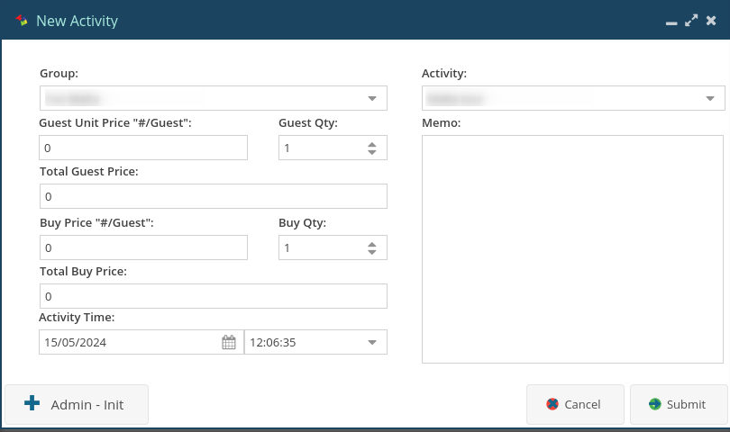

# Release Notes: Version 2.0.7

We are excited to introduce version 2.0.7, a robust update that enhances reservation management with precise status displays, new functionality for adding stays and activities, and improved refresh capabilities for active reservations.

## What's New:

### Accurate Reservation Status

- **Correct EIN, WIN, ACT Display:**
    - Ensure each reservation status accurately shows EIN (Expected In), WIN (Waiting In), and ACT (Active) details, providing clear and precise information.

### New Stay Button & Refresh

- **Add New Stay Button:**
    - A convenient "Add New Stay" button has been added to the top right corner, allowing you to quickly create a new stay.

- **Refresh Functionality:**
    - Easily refresh the reservation list with a single click, ensuring you have the most up-to-date information at all times.

### Activity Module for Reservations

- **Add Activities:**
    - Introducing a new module where you can add activities to a reservation, enhancing the guest experience.
    

- **Financial Tracking:**
    - Enter the Guest Price and Buy Price for each activity and quantity. The system will automatically calculate and display the profit, which will be reflected in your statistics.

### Active Reservations Refresh

- **Real-Time Updates:**
    - Refresh active reservations to keep track of current bookings and statuses seamlessly.

## Important Note:

Ensure you are using version 2.0.7 by checking the version number at the bottom left corner of your reservation system. If not visible, press 'F5' to refresh.

## Upgrade Instructions:

Version 2.0.7 is automatically effective. Log in to your reservation system to experience the new features. For any inquiries or assistance, our support team is ready to help.

Thank you for choosing our reservation system. We are committed to continuous improvement and providing you with a top-notch reservation management experience.

**Best regards,**  
Leviathan Systems

