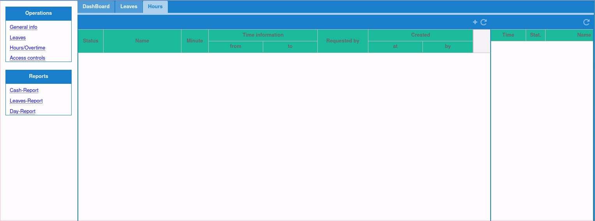

# Release Notes: Version 2.0.9

We are thrilled to announce version 2.0.9!

## What's New:

### Petty Cash System for Accounts

- **Easy Access:**
    - If you are part of the accounting team, you can easily access this new module where you can manage all your petty cash-related tasks.
    
#### Ability to Create New Accounts Per User Preference

- **Custom Account Creation:**
    - Easily create new accounts and name them according to your requirements.
    - On the Accountant dashboard, click the "+" icon to create a new account.
    
#### Create Document for Movement Description

- **Document Creation:**
    - On the Accountant dashboard, click the “Create new document” button to start a movement.
    - Ensure you close a document once you are done.
    - This feature allows you to update the arrival/departure time for your guests to help your team plan better.

#### Mobile Access

- **Cash Request via Mobile:**
    - Your staff now has the ability to create cash requests on their Staff Application.
    - This version of the Mobile app will be available soon.

### Reservation System
#### Edit Reservations Arrival/Departure Time

- **Modify Reservation Times:**
    - Open any reservation you want to edit, right-click on it, go to Check-in/out Options, and click on "edit in/out time".
    - Note: Once a reservation starts or finishes, the options are no longer available.

#### Combined Reservation Staytask

- **Unified Staytask List:**
    - Reservation staytasks are now combined into a single list, instead of separate lists per day.

### HR Module

#### Access:

- If you’re part of the HR department, you’ll find the “HR” module in the main menu.
- After starting the module, you’ll see the list of employees.
- 
- Double-click on a selected employee to open the Employee modules.

#### General Info Module
- **View/Edit Employee Details:**
    - Under this module, you can view and edit the details regarding an employee.
    - You can edit each section using the edit button.
    - In edit mode, you can Save or Cancel modifications using the respective buttons.
    
#### Leaves/Vacation Leaves Module

- **Manage Leave Requests:**
    - This module allows you to edit, approve, reject, and print leave requests.
    - If necessary and if you have the appropriate rights, you can create a new request for anyone.
    
#### Punch-Log and Day-Entries/Overtime Tracking
- **Track Overtime:**
    
    - The HR department can edit, insert, and print staff-submitted overtime requests using this module.
    - This window displays punch-log entries. Each punch-out creates a day-entry containing start/stop/type information. Employees can punch in/out via the mobile app.
    - You can add new entries to the employee page if necessary.
    
#### My Leaves/Vacation

- **Employee Self-Service:**
    - This module is accessible under the “Me” main menu, where every employee can submit and manage their vacation requests.
    
### Version Verification

- **Check Your Version:**
    - Confirm you are using version 2.0.9 by checking the version number at the bottom left corner of your reservation system.

## Important Note:

Ensure you are using version 2.0.9 by checking the version number at the bottom left corner of your reservation system. If not visible, press 'F5' to refresh.

## Upgrade Instructions:

Version 2.0.9 is automatically effective. Log in to your reservation system to experience the new features. For any inquiries or assistance, our support team is ready to help.

Thank you for choosing our reservation system. We are committed to continuous improvement and providing you with a top-notch reservation management experience.

**Best regards,**  
Leviathan Systems

